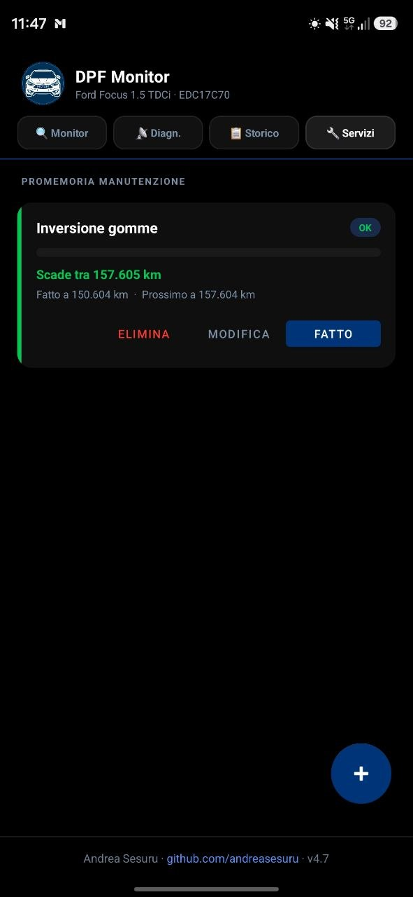
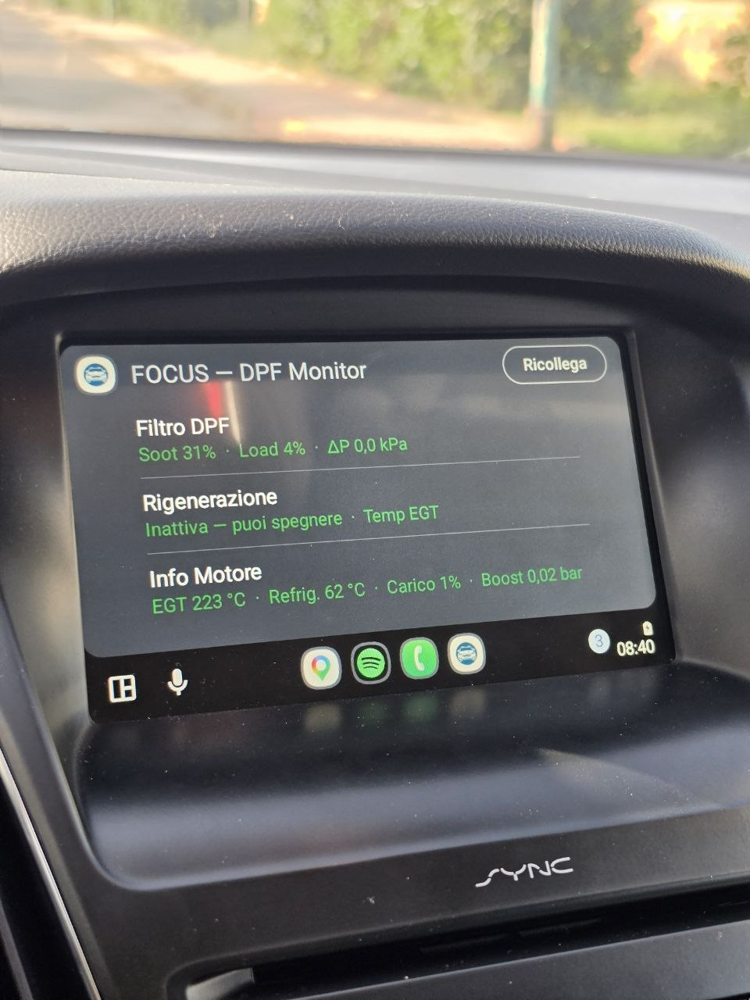

# 🚗 DPF Monitor — Ford Focus 1.5 TDCi

<p align="center">
  
</p>

<p align="center">
  App Android per il monitoraggio in tempo reale del filtro antiparticolato (DPF)<br/>
  della Ford Focus 1.5 TDCi con centralina EDC17C70, tramite dongle OBD2 Bluetooth.
</p>

<p align="center">
  
  
  
  
</p>

---

## 📱 Screenshot

<p align="center">
  
  
  
  
</p>

## 🚗 Android Auto — Ford Focus Sync 3

<p align="center">
  
</p>

---

## ✨ Funzionalità

### 🔍 Monitor
- Gauge circolari per **DPF Load %** e **DPF Soot %** con colori in tempo reale
- **Delta P** (pressione differenziale) con range idle/marcia
- **Stato rigenerazione** automatico: Inattiva / Warning / Attiva / Completata
- Rilevamento regen con doppia strategia: flag ECU diretto o fallback temperatura EGT
- Temperature: EGT, refrigerante
- Distanze ECU: odometro, km da ultima regen, km da ultimo tagliando

### 📡 Diagnostica
- Sensori motore live: RPM, velocità, carico motore, boost (MAP)
- Sezione DPF avanzata: Soot %, Load %, Delta P, EGT, ΔT pre-post DPF
- Barra colorata di stato per ogni cella (verde / ambra / rossa)
- Hint contestuali con range normali per ogni parametro

### 📋 Storico
- Registrazione automatica di ogni sessione di rigenerazione
- Grafico a barre Soot prima/dopo per le ultime 8 sessioni
- Card sessione con: data, km, tipo regen (🔴 Forzata ECU / 🌡 Passiva), EGT picco, risultato
- Export report HTML per il meccanico tramite share sheet

### 🔧 Servizi
- Promemoria manutenzione con card colorate: **verde / arancio / rosso** in base ai km rimanenti
- Barra di avanzamento km usati / intervallo per ogni promemoria
- **Tagliando olio gestito automaticamente** dalla centralina (PID 22 0542): si aggiorna da solo ad ogni connessione, senza input manuale
- Aggiunta promemoria personalizzati (titolo, intervallo km, ultimo intervento)
- Pulsante **Fatto** con dialogo di conferma + registrazione km per azzerare il countdown
- Pulsanti **Modifica** ed **Elimina** per ogni promemoria
- Notifiche push a 1000 km, 500 km e a scadenza raggiunta (una sola volta per intervallo)

### 🔔 Notifiche
- Notifica persistente con stato DPF durante il monitoraggio (aggiornata ogni 5s)
- Allerta vibrazione + suono personalizzato su regen WARNING e ACTIVE
- Promemoria manutenzione a 1000 km / 500 km / scaduto
- Notifica silenziosa su connessione/disconnessione dongle
- Notifica timer cooldown turbo post-regen

### 🚗 Android Auto / Sync 3
- Dashboard con 3 righe: **Filtro DPF**, **Rigenerazione**, **Info Motore**
- Valori colorati (verde/giallo/rosso) in base alle soglie
- CarToast su ogni transizione di stato regen
- Tasto **Ricollega** per riconnettere il dongle senza toccare il telefono

---

## 🛠 Stack tecnico

| Componente | Tecnologia |
|---|---|
| Linguaggio | Kotlin |
| Connettività | Bluetooth LE (BLE) + SPP |
| Protocollo | OBD2 — ELM327 (PIDs Mode 01 + Ford 22xx) |
| Database | Room (SQLite) — v3 |
| Architettura | StateFlow + LifecycleService |
| UI | View Binding — RecyclerView, MPAndroidChart |
| Auto | Android Car App Library 1.4 (categoria IOT) |
| Notifiche | NotificationCompat — 4 canali |

---

## 🔌 Come funziona

```
Dongle OBD2 (ELM327 BLE)
        ↓ Bluetooth
BleManager — polling ogni ~1.5s
        ↓
DpfRepository (StateFlow<DpfData>)
        ↓              ↓              ↓
MainActivity    DpfScreen (Auto)  DpfForegroundService
  (gauge UI)    (ListTemplate)    (notifiche + storico + manutenzione)
```

1. Il dongle OBD2 si collega alla presa diagnostica della Focus
2. L'app interroga la ECU ogni ~1.5 secondi via BLE
3. I dati aggiornano la UI in tempo reale tramite StateFlow
4. Se viene rilevata una rigenerazione, viene registrata nel database Room
5. Il promemoria tagliando si aggiorna automaticamente dai km ECU
6. Su Android Auto, la dashboard è visibile sul display Sync 3 dell'auto

---

## 📋 PID OBD2 utilizzati

| PID | Descrizione | Confermato |
|---|---|---|
| `22 057B` | DPF Soot % | ✅ |
| `22 0579` | DPF Load % | ✅ |
| `01 7A` | Delta P (pressione differenziale) | ✅ |
| `22 050B` | Km dall'ultima rigenerazione | ✅ |
| `22 0542` | Km dall'ultimo cambio olio | ✅ |
| `22 DD01` | Odometro ECU | ✅ |
| `01 0C` | RPM | ✅ |
| `01 0D` | Velocità | ✅ |
| `01 05` | Temperatura refrigerante | ✅ |
| `01 0B` | Pressione collettore (boost) | ✅ |

---

## ⚙️ Requisiti

- Android 8.0+ (API 26)
- Dongle OBD2 Bluetooth (testato con **Android-Vlink** ELM327 BLE)
- Ford Focus 1.5 TDCi con centralina **EDC17C70**
- Per Android Auto: app installata tramite Google Play (Internal Testing)

---

## 👨‍💻 Sviluppatore

**Andrea Sesuru** · [github.com/andreasesuru](https://github.com/andreasesuru)

---

*Progetto personale — sviluppato per uso privato sul proprio veicolo.*
