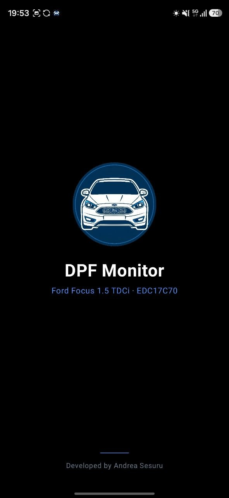
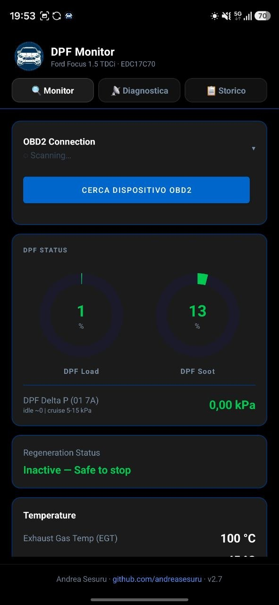
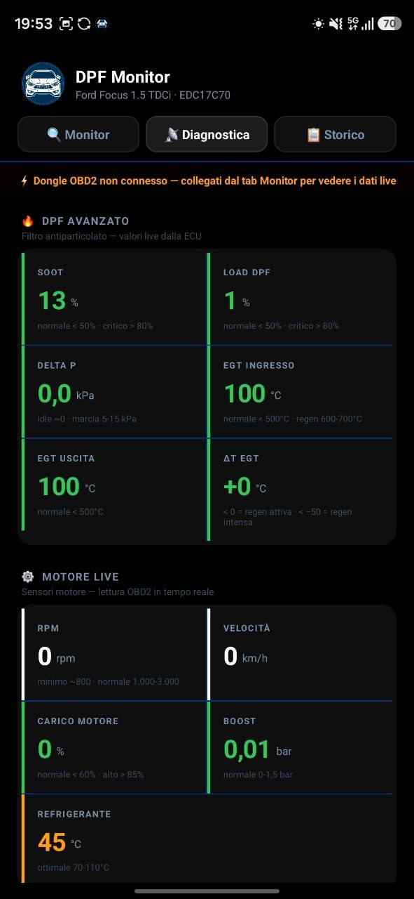
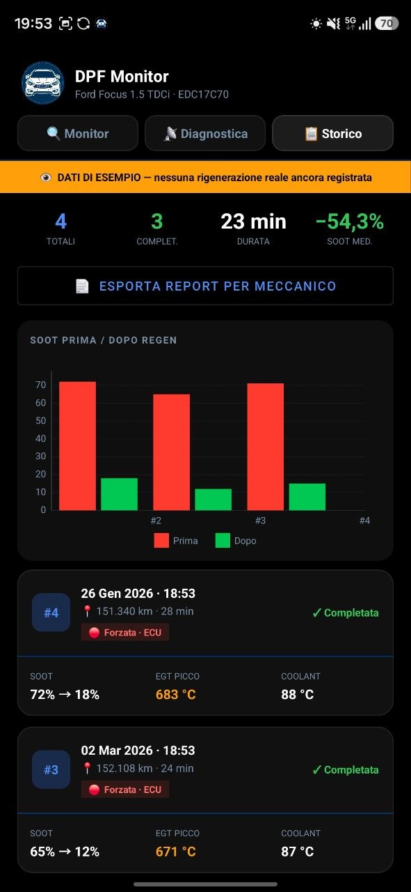

# 🚗 DPF Monitor — Ford Focus 1.5 TDCi

<p align="center">
  
</p>

<p align="center">
  App Android per il monitoraggio in tempo reale del filtro antiparticolato (DPF)<br/>
  della Ford Focus 1.5 TDCi con centralina EDC17C70, tramite dongle OBD2 Bluetooth.
</p>

<p align="center">
  
  
  
  
</p>

---

## 📱 Screenshot

<p align="center">
  
  
  
</p>

---

## ✨ Funzionalità

### 🔍 Monitor
- Gauge circolari per **DPF Load %** e **DPF Soot %** con colori in tempo reale
- **Delta P** (pressione differenziale) con range idle/marcia
- **Stato rigenerazione** automatico: Inattiva / Warning / Attiva / Completata
- Rilevamento regen con doppia strategia: flag ECU diretto o fallback temperatura EGT
- Temperature: EGT ingresso/uscita, refrigerante, ΔT pre-post DPF

### 📡 Diagnostica
- Sensori motore live: RPM, velocità, carico, boost (MAP)
- Sezione DPF avanzato: Soot, Load, Delta P, EGT ingresso/uscita, ΔT
- Distanze ECU: km da ultima regen, km da ultimo tagliando, odometro
- Barra colorata di stato per ogni cella (verde / ambra / rossa)
- Hint contestuali con range normali per ogni parametro

### 📋 Storico
- Registrazione automatica di ogni sessione di rigenerazione
- Grafico a barre Soot prima/dopo per le ultime 8 sessioni
- Card sessione con: data, km, tipo regen (🔴 Forzata ECU / 🌡 Passiva), EGT picco, risultato
- Dati mock di esempio finché non esistono regen reali registrate
- Export report HTML per il meccanico tramite share sheet

### 🔔 Notifiche
- Notifica persistente con stato DPF durante il monitoraggio
- Allerta vibrazione + suono su regen WARNING e ACTIVE
- Promemoria tagliando a 10.000 km (persistente fino al cambio olio)
- Notifica silenziosa su connessione/disconnessione dongle

### 🚗 Android Auto
- Dashboard con 4 righe: Filtro DPF, Rigenerazione, Temperature, Distanze
- Valori colorati (verde/giallo/rosso) in base alle soglie
- CarToast su ogni transizione di stato
- Tasto "Ricollega" per riconnettere il dongle senza toccare il telefono

---

## 🛠 Stack tecnico

| Componente | Tecnologia |
|---|---|
| Linguaggio | Kotlin |
| Connettività | Bluetooth LE (BLE) + SPP |
| Protocollo | OBD2 — ELM327 (PIDs Mode 01 + Ford 22xx) |
| Database | Room (SQLite) |
| Architettura | StateFlow + LifecycleService |
| UI | View system — RecyclerView, MPAndroidChart |
| Auto | Android Car App Library 1.4 (categoria IOT) |
| Notifiche | NotificationCompat — 4 canali |

---

## 🔌 Come funziona

```
Dongle OBD2 (ELM327 BLE)
        ↓ Bluetooth
BleManager — polling ogni ~1.5s
        ↓
DpfRepository (StateFlow<DpfData>)
        ↓              ↓              ↓
MainActivity    DpfScreen (Auto)  DpfForegroundService
  (gauge UI)    (PaneTemplate)    (notifiche + storico)
```

1. Il dongle OBD2 si collega alla presa diagnostica della Focus
2. L'app interroga la ECU ogni ~1.5 secondi via BLE
3. I dati aggiornano la UI in tempo reale tramite StateFlow
4. Se viene rilevata una rigenerazione, viene registrata nel database Room
5. Su Android Auto, la stessa dashboard è visibile sul display dell'auto

---

## 📋 PID OBD2 utilizzati

| PID | Descrizione | Confermato |
|---|---|---|
| `22 057B` | DPF Soot % | ✅ |
| `22 0579` | DPF Load % | ✅ |
| `01 7A` | Delta P (pressione differenziale) | ✅ |
| `22 050B` | Km dall'ultima rigenerazione | ✅ |
| `22 0542` | Km dall'ultimo cambio olio | ✅ |
| `22 DD01` | Odometro ECU | ✅ |
| `01 0C` | RPM | ✅ |
| `01 0D` | Velocità | ✅ |
| `01 05` | Temperatura refrigerante | ✅ |
| `01 0B` | Pressione collettore (boost) | ✅ |

---

## ⚙️ Requisiti

- Android 8.0+ (API 26)
- Dongle OBD2 Bluetooth (testato con **Android-Vlink** ELM327 BLE)
- Ford Focus 1.5 TDCi con centralina **EDC17C70**
- Per Android Auto: app installata tramite Google Play (Internal Testing)

---

## 👨‍💻 Sviluppatore

**Andrea Sesuru** · [github.com/andreasesuru](https://github.com/andreasesuru)

---

*Progetto personale — sviluppato per uso privato sul proprio veicolo.*
